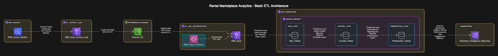
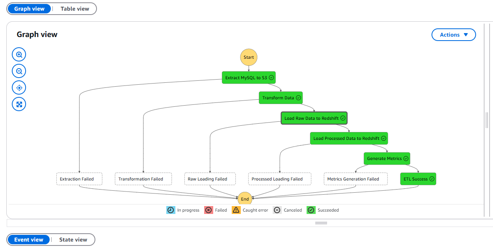

# Rental Marketplace Analytics ETL Pipeline

## Overview

This project implements a batch data processing pipeline for a rental marketplace platform (similar to Airbnb) to enable analytical reporting on rental listings and user interactions. The pipeline extracts data from AWS Aurora MySQL, processes it using AWS Glue, and loads it into Amazon Redshift for business intelligence and reporting.



*Figure 1: High-level architecture diagram of the rental marketplace analytics pipeline*

## Project Structure

```markdown
├── aws/                      # AWS infrastructure code
│   ├── etl_job.py           # Glue ETL job script
│   └── step_function.json   # Step Function definition
├── data/                    # Raw data files
│   ├── apartment_attributes.csv
│   ├── apartments.csv
│   ├── bookings.csv
│   └── user_viewing.csv
├── docs/                    # Documentation
├── notebooks/               # Jupyter notebooks for analytics
│   ├── rental_performance_metrics.ipynb  # Rental performance analysis
│   └── user_engagement_metrics.ipynb     # User engagement analysis
├── scripts/                 # Utility scripts
│   ├── deploy_aws.py        # AWS deployment script
│   ├── setup_rds.py         # RDS setup script
│   └── setup_redshift.py    # Redshift setup script
├── sql/                     # SQL scripts
│   └── redshift/            # Redshift SQL scripts
│       ├── 01_create_raw_layer.sql
│       ├── 02_create_curated_layer.sql
│       ├── 03_create_presentation_layer.sql
│       ├── 04_populate_curated_layer.sql
│       ├── 05_populate_presentation_layer.sql
│       └── 06_create_stored_procedures.sql
└── src/                     # Source code
    ├── config/              # Configuration
    ├── database/            # Database models and connection
    ├── etl/                 # ETL pipeline code
    └── monitoring/          # Monitoring and quality checks
```

## Setup

### Prerequisites

1. Python 3.9+
2. AWS account with appropriate permissions
3. MySQL RDS instance (Aurora MySQL)
4. Amazon Redshift cluster
5. AWS Glue service configured
6. AWS Step Functions configured
7. AWS credentials configured

### Installation

1. Create and activate a virtual environment:

```bash
python -m venv .venv
source .venv/bin/activate  # Linux/Mac
.venv\Scripts\activate     # Windows
```

2. Install dependencies:

```bash
pip install -r requirements.txt
```

3. Copy `.env.example` to `.env` and update with your configurations:

```bash
cp .env.example .env
```

### AWS Setup

1. Create an S3 bucket for storing ETL data:

```bash
aws s3 mb s3://rental-marketplace-data
```

2. Set up the Redshift schema:

```bash
python scripts/setup_redshift.py
```

3. Deploy AWS resources (Glue job and Step Function):

```bash
python scripts/deploy_aws.py
```

## Running the Pipeline

### Local Development

Run the ETL pipeline locally:

```bash
python main.py --listings-days 7 --activity-days 7 --metrics-days 30
```

### AWS Production

1. Trigger the Step Function:

```bash
aws stepfunctions start-execution --state-machine-arn <your-state-machine-arn>
```

2. Monitor execution in AWS Console:

- Check Step Function execution status
- View Glue job logs
- Monitor CloudWatch metrics



*Figure 3: AWS Step Function graph view showing the ETL pipeline workflow*

## Data Flow

1. Extract data from MySQL RDS (Aurora)
2. Transform data (calculate metrics)
3. Load processed data to S3 as an intermediate storage layer
4. Ingest data from S3 into Amazon Redshift
5. Process data through multi-layer architecture in Redshift:
   - Raw Layer: Data as close as possible to the source
   - Curated Layer: Cleaned and transformed data
   - Presentation Layer: Aggregated data for reporting


*Figure 2: Mind map of the project components and data flow*

## Key Business Metrics

### Rental Performance Metrics
- **Average Listing Price**: Weekly average price of active rental listings
- **Occupancy Rate**: Percentage of available rental nights booked over a month
- **Most Popular Locations**: Most frequently booked cities every week
- **Top Performing Listings**: Properties with highest confirmed revenue per week

### User Engagement Metrics
- **Total Bookings per User**: Count of rentals booked per user every week
- **Average Booking Duration**: Mean duration of confirmed stays over time
- **Repeat Customer Rate**: Users who book more than once within a rolling 30-day period

## Analytics Notebooks

The project includes Jupyter notebooks for analyzing the key business metrics:

1. `rental_performance_metrics.ipynb`: Analyzes rental performance metrics
2. `user_engagement_metrics.ipynb`: Analyzes user engagement metrics

These notebooks connect to Redshift to query the presentation layer data and visualize the results.

## Contributing

1. Fork the repository
2. Create a feature branch
3. Commit changes
4. Create a pull request

## License

This project is licensed under the MIT License.
