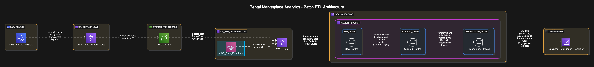

# Rental Marketplace Analytics Architecture

## Overview

This document provides a detailed explanation of the architecture used in the Rental Marketplace Analytics ETL pipeline.

*Figure 1: High-level architecture diagram of the rental marketplace analytics pipeline*

## Architecture Components

### Data Sources

- **AWS Aurora MySQL**: Primary transactional database that stores rental listings, user interactions, and booking information.

### Data Processing

- **AWS Glue**: Serverless ETL service used to extract data from MySQL, transform it, and load it into Amazon Redshift.
- **AWS Step Functions**: Orchestrates the ETL workflow, ensuring that each step is executed in the correct order.
- **Amazon S3**: Acts as an intermediate storage layer for the extracted and transformed data.

### Data Warehouse

- **Amazon Redshift**: Data warehouse used for analytical queries and reporting.
- **Multi-layer Architecture**:
  - **Raw Layer**: Data as close as possible to the source
  - **Curated Layer**: Cleaned and transformed data
  - **Presentation Layer**: Aggregated data for reporting

## ETL Workflow

The ETL workflow is orchestrated by AWS Step Functions, which coordinates the execution of AWS Glue jobs:

*Figure 2: AWS Step Function graph view showing the ETL pipeline workflow*

1. **Extract MySQL to S3**: Extracts data from Aurora MySQL and stores it in S3 in Parquet format.
2. **Transform Data**: Processes the raw data to calculate metrics and prepare it for loading into Redshift.
3. **Load Raw Data to Redshift**: Loads the raw data into the raw layer in Redshift.
4. **Load Processed Data to Redshift**: Loads the transformed data into the curated layer in Redshift.
5. **Generate Metrics**: Calculates business metrics and loads them into the presentation layer in Redshift.

## Project Components

The project is organized into several components, as shown in the mind map below:

*Figure 3: Mind map of the project components and data flow*

### Key Components

- **AWS Infrastructure**: Includes Glue jobs, Step Functions, and IAM roles.
- **ETL Pipeline**: Includes extraction, transformation, and loading scripts.
- **Data Models**: Defines the schema for the raw, curated, and presentation layers.
- **Monitoring**: Includes logging, error handling, and quality checks.
- **Analytics**: Includes Jupyter notebooks for analyzing the data.

## Data Flow

1. **Extraction**: Data is extracted from Aurora MySQL using AWS Glue JDBC connections.
2. **Transformation**: Data is transformed using AWS Glue PySpark jobs.
3. **Loading**: Transformed data is loaded into Amazon Redshift using AWS Glue.
4. **Analytics**: Data is analyzed using SQL queries and Jupyter notebooks.

## Security Considerations

- **IAM Roles**: Least privilege access for AWS services.
- **Data Encryption**: Data is encrypted at rest in S3 and Redshift.
- **Network Security**: VPC security groups control access to RDS and Redshift.

## Monitoring and Maintenance

- **CloudWatch**: Monitors the execution of Glue jobs and Step Functions.
- **Error Handling**: Comprehensive error handling in Glue jobs and Step Functions.
- **Logging**: Detailed logging for troubleshooting and auditing.

## Conclusion

This architecture provides a scalable, reliable, and maintainable solution for processing rental marketplace data for analytics and reporting. The use of AWS managed services reduces operational overhead and allows for easy scaling as data volumes grow.
